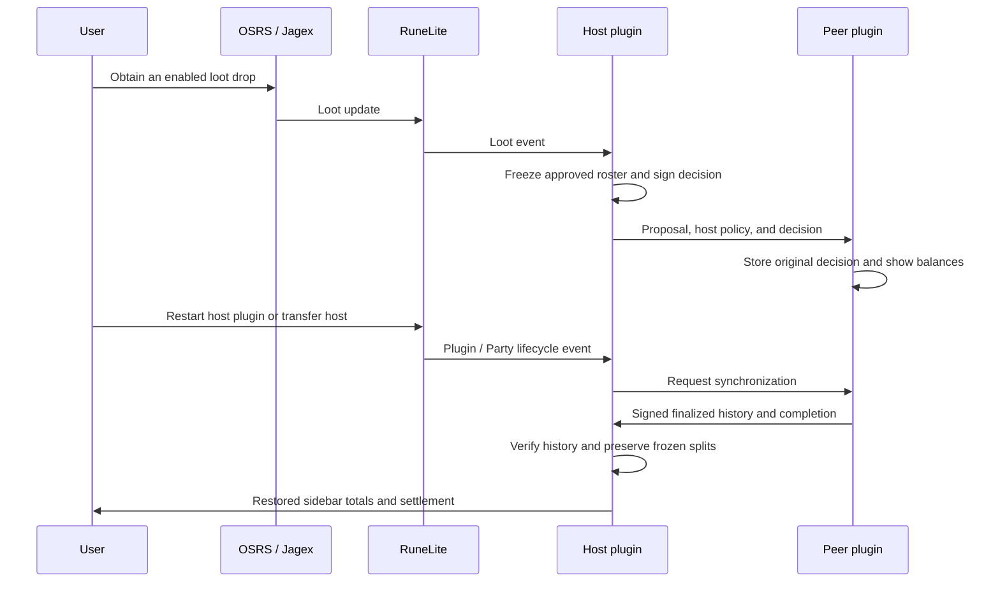

<!--
Created with assistance from:
https://github.com/pk-enjoyer/runelite-plugin-developer-marketplace
-->

# Community Lootshare

Community Lootshare 4.0 is a RuneLite plugin for host-managed, party-shared
loot tracking. Its active sidebar can create, join, rejoin, and leave RuneLite
Parties, control member eligibility, inspect per-member loot, and calculate the
payments needed to settle a shared session.

## Current Status

The active Community Lootshare implementation provides:

- a loadable `LootsharePlugin` entry point and the stable
  `community-lootshare` config group;
- host-filtered NPC-drop capture from RuneLite's `ServerNpcLoot` event while the
  local player is in a RuneLite Party, plus `LootReceived` capture for RuneLite's
  other tracked loot sources, with identical same-tick event suppression;
- a locally saved hosted-party policy covering NPC, activity, player,
  pickpocket, and unknown loot sources; Grand Exchange or high-alchemy
  valuation; the minimum value included in split calculations; and whether
  logged-out Party members join frozen split rosters;
- capture and Party transmission of every enabled drop regardless of its value;
  the host's minimum only filters split calculations and never hides or blocks
  an otherwise enabled drop;
- revisioned host-policy synchronization: guests use the host's effective
  policy without overwriting their own saved preferences and pause new capture
  while waiting for a valid host snapshot;
- immutable item and pricing IDs, quantities, captured unit prices, capture
  timestamps, and overflow-checked event totals;
- bounded, versioned Party proposal and decision messages whose sender identity
  comes from RuneLite Party rather than the message payload;
- host-controlled member eligibility: the host is always approved, new members
  start pending, and the host can approve or exclude them from their member card;
- automatic host decisions for every capture: approved members' loot is accepted
  with the currently approved roster frozen into it, while pending or excluded
  members' loot is rejected and hidden;
- Party-scoped ledgers that resume on rejoin, duplicate/conflict handling, and
  late-join state sync; guests replay signed finalized decisions and their own
  pending contributions when a host recovers; original split rosters stay frozen;
- exact integer split calculation, deterministic remainder assignment, and
  payer-to-receiver settlement transfers;
- asynchronous, atomic, schema-versioned JSON persistence under
  `~/.runelite/community-lootshare/`, scoped to the active RuneLite profile;
  schema-8 snapshots use gzip at a stable profile-ID path, so renaming a profile
  keeps its history. A single legacy name-based file migrates with its original
  preserved as a backup. Invalid records, ambiguous migrations, and unsupported
  schemas remain read-only. Writes are bounded to 5 MiB compressed and 64 MiB
  expanded, and failed writes retain the last good file;
- an active Community Lootshare sidebar with Party controls, including rejoining
  the previous Party, first-member host election, right-click host transfer, a
  collapsible effective-host-settings summary, eligibility badges/actions,
  per-member loot summaries, and an auto-opening settlement section;
- exact balance and direct-payment tables plus a reusable settlement dashboard
  with GP/hr, highest-earnings, and settlement-balance graphs.

Eligibility changes only affect future decisions. Every accepted proposal keeps
its frozen roster, so excluding a member later does not rewrite earlier balances.

## Current UI Direction

The sidebar now covers Party setup, the effective host policy, member eligibility,
per-member loot inspection, balances, and settlement payments. The graph button
opens one reusable settlement dashboard window and focuses it if it is already
open. **History** opens a reusable browser of host chains and frozen cumulative
checkpoints, including stored Parties after leaving. Local console notices report
host departures, takeovers, and explicit settings applications. An overlay and
general loot notifications are not implemented yet.

## Inherited settings and host history

Only a fresh Party starts from its founder's saved preferences. Succession,
right-click transfers, restarts, and rejoins retain the effective Party policy,
accepted and rejected loot, pending contributions, approvals, and balances. When
an established host leaves RuneLite Party, the remaining member with the lowest
Party member ID succeeds them. Logging out of OSRS while staying in Party does
not end the host period.

Editing plugin configuration saves personal preferences. To apply them to the
current Party, the host opens **Host settings** and clicks **Apply my settings**.
It applies immediately, without confirmation. The button is disabled during
synchronization or recovery and when preferences already match. The request
checks the displayed Party, host, and revision; an old click cannot change a
new host or policy. Identical preferences produce no revision, audit, or notice.

A new minimum split value recalculates **all carried accepted loot**. Captured
prices, decisions, and participant rosters stay fixed. Valuation and capture
changes affect new captures; eligibility and manual GP policy affect subsequent
contributions and decisions. Departed members retain their historical shares.

**History** groups records by Party, shows the chronological host chain, and
lists completed host sessions newest first. Each session has a frozen cumulative
checkpoint: ending settings, total, balances, transfers, and its settings
application timeline with before/after settlements. These totals are cumulative,
not the loot earned only during that host's period.

Deliberate transfers finalize pending contributions under the outgoing policy
before archiving and transferring authority. Departures retain the outgoing
boundary and settings while the successor recovers finalized decisions and audit
events. New decisions wait for replies, with the existing three-second fallback.
A checkpoint is **incomplete** if peers did not reply or committed records are
missing. Late verified recovery can improve the active ledger but cannot rewrite
an archived checkpoint. Loot that reached no other client cannot be reconstructed.
A locally departing host retains its pending boundary for authoritative recovery
on rejoin; it cannot reclaim authority while waiting for the live Party snapshot.

Protocol-7 host snapshots carry current host-period metadata and bounded history
commitments. Version-1 history messages deliver events in bounded chunks.
Signatures cover each full event; peer replay also requires its exact commitment
from authenticated host state. Former-host key trust alone is insufficient.
Consecutive departures during recovery retain each outgoing boundary. The recovering
host also replays newly imported history to connected guests, including guests that
synchronized before recovery finished. Audit and transfer timestamps cannot precede
the inherited period start, even when host clocks differ.

Initial sync and replay do not repeat old chat notices. Full history stays in the
profile file; RuneLite configuration caches authority and commitments only.

The latest **256 events per Party** are retained, with an explicit earlier-history
omission marker. Legacy histories keep their loot and settings and label missing
host chains as unknown. Failed writes preserve the last good file and show a
storage notice in the sidebar. All participating clients should use this update;
older payloads are readable, but missing historical details are not fabricated.

## Manual GP

The Party host can add a manual GP contribution to any approved member. The
host may enable **Allow member manual GP** to let approved members add GP only
to themselves. These contributions use the same Party-synchronised proposal,
settlement, and persisted-history paths as captured loot; OSRS chat commands
and chat value parsing are not supported. Manual contributions display as
**Manual GP** with a coin icon and their captured GP value.

## Host recovery

Use the same updated plugin version on every Party client. Host snapshots now use
protocol 7; older host protocols 3, 4, 5, and 6 remain readable, but older clients cannot
participate in the new recovery exchange.

A restarted or newly transferred host requests peer history and briefly holds new
decisions until peers finish replying, with a three-second fallback. Peers send
complete finalized contributions with host signatures covering the original value,
owner, timestamp, status, and roster. Recovery verifies the signature against
previously trusted host keys and requires a SHA-256 commitment to the exact decision
in an authenticated host snapshot. This prevents former hosts from signing new,
backdated contributions after transferring authority. Decision timestamps use the
same millisecond precision on disk and over Party. Late committed signed records
can still recover after the fallback if they do not conflict with a local decision.
Older key-only snapshots cannot authorize unseen peer history; retained local
records acquire commitments when loaded and synchronized by an authorized host.

The private signing identity is stored in a separate `.signer` file beside the
profile ledger and loaded by the background profile task. Public host authority and
key bindings and decision commitments are also cached in RuneLite configuration, allowing a missing or older
ledger to recover without silently replacing host authority. Keep the signing file
when backing up a profile. A corrupt signing file is preserved and makes the profile
read-only. Unsigned legacy history can only be confirmed by the authenticated first
Party member during recovery and must match a committed decision. Recovery cannot
reconstruct history if no peer retains
it or no trusted authority remains.

## Manual validation of the edge-case fixes

Automated tests cover invalid-file preservation and message ordering. The remaining
live-client check uses ordinary user actions; no game input is automated:



1. With two updated clients, create a Party, approve both members, and record an
   ordinary drop plus a manual GP contribution. Both sidebars should agree; manual
   GP should show its label, coin icon, and actual amount.
2. Exclude a member after an accepted contribution, then restart the host plugin
   or transfer host. Existing balances and original rosters should stay unchanged;
   new contributions should follow current eligibility after recovery finishes.
3. Leave and rejoin as a guest after a host transfer, including after the old host
   leaves. The guest should recognize the current host and receive its ledger.
4. Rename the RuneLite profile, restart the plugin, and check that totals persist.
5. Restart the host while another client is unavailable. After the short recovery
   fallback, new eligible contributions should finalize normally. Disable the
   plugin during that wait and verify it sends no later decisions.

For the host-settings and history changes, use two updated development clients:

1. Give Alice and Bob different saved thresholds and valuation preferences. Create
   a Party as Alice, approve Bob, and record two contributions on opposite sides
   of Bob's threshold. Compare both running balances and effective settings.
2. Transfer host to Bob. Verify Alice's settings and balances are inherited, a
   single takeover notice appears, and History contains Alice's unchanged
   cumulative checkpoint. Repeat using Alice's Party departure/disconnect.
3. Edit Bob's configuration. Verify the Party still uses the inherited policy.
   Click **Apply my settings**; check the changed-settings notice, recalculated
   running balances, and before/after audit. Alice's saved checkpoint stays fixed.
4. Restart Bob, rejoin Alice, and transfer back. Check the current host, inherited
   settings, original rosters, historical shares for departed members, and the
   chronological chain. Log out of OSRS while staying in RuneLite Party and verify
   that no host period closes.
5. Delay a peer's reply beyond three seconds. Inspect the incomplete checkpoint,
   then reconnect the peer: running totals can improve while the checkpoint stays
   unchanged. Replayed history must not repeat old notices.
6. Open History twice, inspect balances/transfers and the settings timeline, leave
   Party, and open it again. The window is reused; disabling the plugin closes it.

Login to the development client using RuneLite's
[Using Jagex Accounts](https://github.com/runelite/runelite/wiki/Using-Jagex-Accounts)
instructions. In-game confirmation remains a manual step.

## Development

The sources target Java 11. On the documented workstation, run Gradle with the
Java 21 JDK because the pinned Lombok version does not compile under Java 25:

```sh
env JAVA_HOME=/usr/lib/jvm/java-21-temurin-jdk ./gradlew test
```

Other useful commands are:

```sh
env JAVA_HOME=/usr/lib/jvm/java-21-temurin-jdk ./gradlew build
env JAVA_HOME=/usr/lib/jvm/java-21-temurin-jdk ./gradlew shadowJar
env JAVA_HOME=/usr/lib/jvm/java-21-temurin-jdk ./gradlew run
```

`./gradlew run` starts RuneLite in developer/debug mode with assertions enabled,
loads `com.communitylootshare.LootsharePlugin`, and exercises the
active event/Party/persistence/UI boundary. It does not automate login or
gameplay.
